= Introduction à l'Intelligence Artificielle
:subtitle: Des systèmes experts aux modèles génératifs
:revealjs_customtheme: css/chimie-paristech.css
:revealjsdir: node_modules/reveal.js
:revealjs_slideNumber: c/t
:revealjs_progress: true
:revealjs_transition: slide
:revealjs_width: 1920
:revealjs_height: 1080
:revealjs_hash: true
:revealjs_center: false
:revealjs_plugins: [highlight]
:source-highlighter: highlight.js
:icons: font

[.title-slide]
== Introduction à l'Intelligence Artificielle

[.subtitle]
Des systèmes experts aux modèles génératifs

[.conference-info]
Conférence — 2024 · ~60 minutes

[NOTE.speaker]
--
Présentation destinée à des élèves ingénieurs Bac+5 et doctorants.
Durée estimée : 60 minutes + questions.
--

== Sommaire

[.columns]
--
[.column]
. *Histoire de l'IA* — des origines aux LLMs
. *Les Transformers* — comment ça marche vraiment
. *IA en chimie* — AlphaFold et au-delà
. *Le futur* — raisonnement, AGI

[.column]
> « L'intelligence artificielle est peut-être l'un des effets de levier les plus importants de l'histoire de l'humanité. »
>
> -- Geoffrey Hinton, Prix Nobel de Physique 2024
--

[NOTE.speaker]
--
Le Prix Nobel 2024 de Physique a été attribué à Geoffrey Hinton et John Hopfield pour leurs travaux fondateurs en réseaux de neurones — signe que l'IA est maintenant reconnue comme science fondamentale.
--

// ===========================================================
// PARTIE 1 : HISTOIRE DE L'IA
// ===========================================================

[.part-slide]
== Partie 1 +
Histoire de l'Intelligence Artificielle

[.part-subtitle]
Des systèmes experts aux réseaux de neurones profonds

== 1950 — La question de Turing

[.two-columns]
--
[.column]
=== "Can machines think ?"

Alan Turing pose la question en 1950 dans _Computing Machinery and Intelligence_.

Il propose le **Test de Turing** : si un humain ne peut pas distinguer la machine de l'humain dans une conversation, la machine est "intelligente".

*Ce test est-il la bonne mesure ?*

→ Non, mais il a structuré 70 ans de recherche.

[.column]
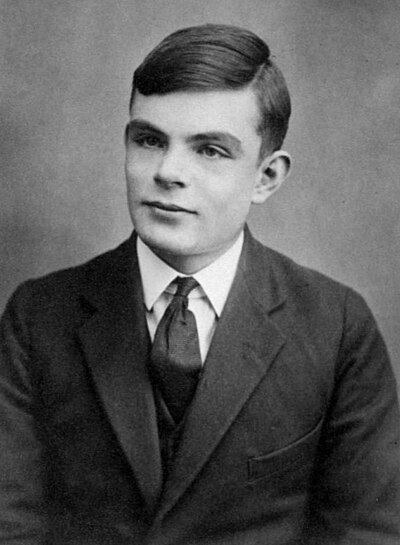
[.caption]
Alan Turing (1912–1954) — père de l'informatique théorique +
_(Wikimedia Commons / photographie de 1928)_
--

[NOTE.speaker]
--
Turing était aussi chimiste : il a modélisé la morphogenèse (formation des taches de léopard) avec des équations de réaction-diffusion. Connexion directe avec la chimie !
--

== 1956 — La naissance officielle du terme "IA"

[.timeline-slide]
--
[.event]
*Dartmouth Conference (1956)* +
John McCarthy, Marvin Minsky, Claude Shannon, Nathaniel Rochester +
→ Naissance officielle du terme **"Artificial Intelligence"**

[.event]
*Hypothèse centrale* +
"Every aspect of learning or any other feature of intelligence can in principle be so precisely described that a machine can be made to simulate it."

[.event]
*Optimisme débridé* +
"Dans 20 ans, les machines feront tout ce qu'un humain peut faire." +
_(Spoiler : c'était trop optimiste... mais l'intuition était juste)_
--

== 1960-1970 — L'IA symbolique : la règle comme intelligence

[.columns]
--
[.column]
=== Le paradigme **Good Old-Fashioned AI** (GOFAI)

L'intelligence = *manipulation de symboles* selon des règles logiques

[source,lisp]
----
(DEFUN est-alcool (molecule)
  (AND (contient-OH molecule)
       (C-sp3 molecule)))
----

LISP (1958, McCarthy) devient **le** langage de l'IA.

*Résultats impressionnants* :
- ELIZA (1966) — chatbot thérapeutique
- SHRDLU (1970) — compréhension de phrases en monde de blocs

[.column]
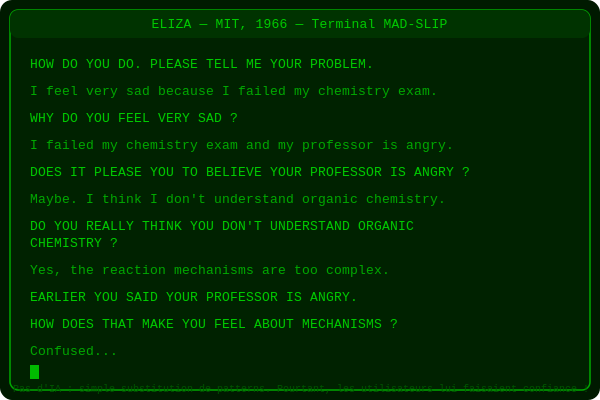
[.caption]
ELIZA — premier chatbot, simulant un psychothérapeute rogérien
--

== 1980 — Les systèmes experts : l'IA industrielle

[.columns]
--
[.column]
=== Le modèle SI-ALORS

Un système expert encode la connaissance d'un expert humain sous forme de règles :

[source]
----
SI pH < 7
ALORS solution est acide

SI solution est acide
  ET présence de Fe³⁺
ALORS risque de corrosion = ÉLEVÉ
----

*DENDRAL (1965)* — Stanford
Identification de structures chimiques par spectrométrie de masse
→ Premier usage de l'IA en chimie !

*MYCIN (1972)* — Diagnostic médical
→ Performances supérieures aux médecins humains dans son domaine

[.column]
=== La limite fondamentale

[.limitation-box]
La connaissance du monde ne peut pas être encodée à la main

* Des milliers de règles à maintenir
* Connaissance fragmentée, pas de généralisation
* Incapacité à apprendre de nouveaux exemples
* "Brittleness" : hors domaine = échec total

*L'hiver de l'IA* frappe en 1987 :
financement s'effondre, promesses non tenues
--

== 1997 — Deep Blue : les machines battent les champions

[.columns]
--
[.column]
=== Un tournant symbolique

*11 mai 1997* : Deep Blue (IBM) bat Garry Kasparov au jeu d'échecs (3,5 – 2,5).

*Ce que Deep Blue n'est PAS* :
[.limitation-box]
Deep Blue ne "pense" pas — il évalue 200 millions de positions/seconde avec des heuristiques codées à la main.

*Mais le signal est clair* : les machines peuvent surpasser les humains dans des domaines formalisables.

*1996-2016 — Succès de l'IA symbolique hybride* :
- Reconnaissance de chèques bancaires (LeCun, 1998)
- Spam filtering (Naive Bayes)
- Moteurs de recommandation

[.column]
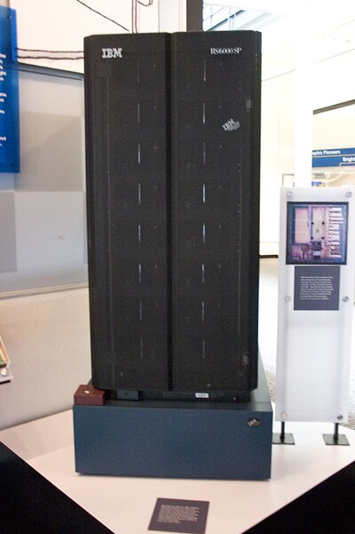
[.caption]
IBM Deep Blue — premier programme à battre un champion du monde d'échecs en titre +
_(© Wikimedia Commons / IBM)_
--

[NOTE.speaker]
--
Kasparov a été très perturbé par la "créativité" de Deep Blue lors de certains coups — des coups que le logiciel a joués parce qu'ils ne déclenchaient pas de pénalité dans sa fonction d'évaluation, pas parce qu'il "voyait" une stratégie à long terme. Ce malentendu sur la nature de l'IA est encore courant aujourd'hui.
--

== 1986-1995 — Le Machine Learning : laisser les données parler

[.columns]
--
[.column]
=== Du "programmer" à "apprendre"

*Paradigme shift fondamental* :

[.comparison]
|===
| IA classique | Machine Learning
| Humain écrit des règles | Machine apprend des règles depuis les données
| Représentation manuelle | Représentation automatique
| Expertise explicite | Patterns cachés dans les données
|===

*Algorithmes clés* :
- *Perceptron (Rosenblatt, 1958)* — premier neurone artificiel
- Backpropagation (Rumelhart, Hinton 1986) — réseaux de neurones multi-couches
- SVM — Support Vector Machines (Vapnik 1995)
- Arbres de décision, forêts aléatoires

[.column]
=== Le perceptron : premier neurone artificiel

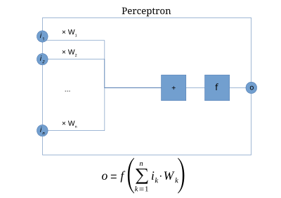
[.caption]
Le perceptron de Rosenblatt (1958) : somme pondérée des entrées + seuil d'activation. +
Limite : seulement les problèmes linéairement séparables. La backpropagation (1986) permettra d'empiler les couches.
--

[NOTE.speaker]
--
La backpropagation est l'algorithme fondateur. L'idée : calculer le gradient de l'erreur par rapport aux poids du réseau, puis ajuster les poids dans le sens inverse du gradient. Simple conceptuellement, mais difficile à faire fonctionner en pratique à l'époque.
--

== 2006-2012 — La renaissance : le Deep Learning

[.columns]
--
[.column]
=== Geoffrey Hinton & co. relancent les réseaux profonds

*Problème historique* : les réseaux profonds ne s'entraînaient pas bien (vanishing gradient)

*Solutions* :
- Pre-training couche par couche (Hinton 2006)
- Nouvelles fonctions d'activation (ReLU)
- Dropout (régularisation)
- GPU comme accélérateur d'entraînement

*ImageNet 2012* → révolution AlexNet

[source]
----
Taux d'erreur ImageNet :
Meilleure méthode classique : 26.2%
AlexNet (deep learning) :    15.3%
----

→ Gain de 10 points d'un coup. L'ère du deep learning commence.

[.column]
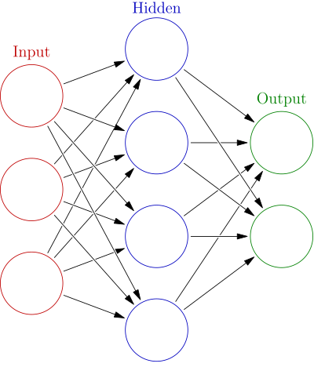
[.caption]
Architecture d'un réseau de neurones : couches d'entrée, cachées, sortie. +
La profondeur (10-1000+ couches) permet d'apprendre des représentations hiérarchiques : pixels → bords → formes → objets +
_(© Wikimedia Commons)_
--

== 2017 — "Attention is All You Need"

[.quote-slide]
--
[quote, Vaswani et al., Google Brain 2017]
____
We propose a new simple network architecture, the Transformer, based solely on attention mechanisms, dispensing with recurrence and convolutions entirely.
____

*Ce papier change tout* :
→ Plus de RNN (lents, difficile à paralléliser)
→ L'attention permet de voir *tout le contexte en une seule opération*
→ Scalable sur GPU/TPU

*6 ans plus tard* : GPT-4, Gemini, Claude, Mistral... sont tous des Transformers

_Voir la partie suivante pour comprendre le mécanisme_
--

[NOTE.speaker]
--
Ce papier a été cité plus de 100 000 fois. C'est l'un des papiers les plus influents de l'histoire de l'informatique.
--

== 2020-2024 — L'explosion des LLMs

[.timeline-horizontal]
--
[.step]
*2018* +
BERT (Google) +
110M params

[.step]
*2020* +
GPT-3 (OpenAI) +
175B params

[.step]
*2022* +
ChatGPT +
1M users en 5 jours

[.step]
*2023* +
GPT-4, Gemini, Llama +
Multimodal

[.step]
*2024* +
o1, Gemini Ultra +
Reasoning amélioré
--

[.key-insight]
La loi de scaling : doubler les données × la taille du modèle → performance prévisible +
*(Kaplan et al., OpenAI 2020)*

// ===========================================================
// PARTIE 2 : LES TRANSFORMERS
// ===========================================================

[.part-slide]
== Partie 2 +
Comment fonctionnent les Transformers

[.part-subtitle]
Plongée dans le mécanisme qui révolutionne l'IA

== Intuition : prédire le prochain mot

[.prediction-demo]
--
*Exercice mental* :

> La réaction de Diels-Alder est une cycloaddition [4+2] qui implique un diène et un **___**

Vous avez deviné : *diénophile* — et probablement avec un haut degré de confiance.

*C'est exactement ce que fait un LLM* — mais sur des milliards d'exemples de texte.

[.key-insight]
Un modèle entraîné uniquement à prédire le prochain token apprend implicitement la syntaxe, la sémantique, les faits du monde... et même le raisonnement.

*Pourquoi ?* Parce que pour prédire correctement, il faut comprendre.
--

== Les embeddings : les mots dans l'espace vectoriel

[.columns]
--
[.column]
=== Représentation vectorielle

Chaque mot → vecteur de N dimensions (N = 768, 1024, 4096...)

[.math-box]
----
"benzène"  → [0.23, -0.87, 0.41, ...]
"toluène"  → [0.25, -0.84, 0.39, ...]  ← proche !
"chien"    → [-0.71, 0.12, -0.55, ...]  ← loin
----

[.ft-quote]
____
"Just as you might describe a house by its characteristics — type, location, bedrooms, bathrooms, storeys — the values in an embedding quantify a word's linguistic features. The way these characteristics are derived means we don't know exactly what each value represents, but words we expect to be used in comparable ways often have similar-looking embeddings."

-- Financial Times, _Generative AI exists because of the transformer_ (2023)
____

*Propriété remarquable* : les relations sémantiques sont des vecteurs

[.math-box]
----
roi - homme + femme ≈ reine
benzène - H + CH₃ ≈ toluène  ?
----

Ces vecteurs sont *appris* depuis les données — pas programmés à la main.

[.column]
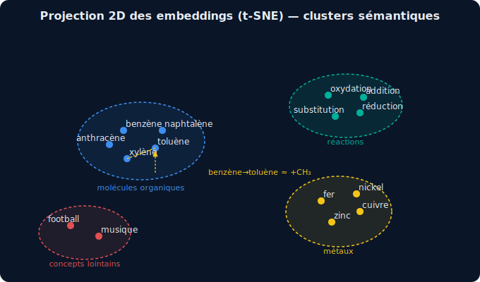
[.caption]
Projection 2D d'embeddings (t-SNE) : les mots sémantiquement proches sont proches dans l'espace vectoriel
--

[NOTE.speaker]
--
Les embeddings sont la première couche du transformer. Ils transforment chaque token (mot ou sous-mot) en vecteur dense. Ces vecteurs encodent le sens de façon distribuée sur toutes les dimensions — pas une dimension = une feature.
--

== L'attention : "qui regarde qui" ?

[.columns]
--
[.column]
=== Le mécanisme clé du Transformer

[.ft-quote]
____
"Before transformers, the state of the art AI translation methods were recurrent neural networks (RNNs), which scanned each word in a sentence and processed it _sequentially_. With self-attention, the transformer computes all the words in a sentence _at the same time_."

-- Financial Times, _Generative AI exists because of the transformer_ (2023)
____

Pour chaque mot, l'attention calcule :
*"Quels autres mots de la séquence sont pertinents pour comprendre ce mot ici ?"*

[.example-box]
--
> "La **molécule** de benzène est aromatique car elle possède **ses** électrons π délocalisés"

Pour résoudre "ses" → le modèle attend **fortement** sur "molécule"

Pour comprendre "aromatique" → attention sur "benzène" ET "électrons π"
--

*Formule de l'attention* :

[.math-box]
Attention(Q, K, V) = softmax(QKᵀ / √d_k) · V

Q = Query (ce que je cherche), K = Key (ce que j'offre), V = Value (ce que je transmets)

[.column]
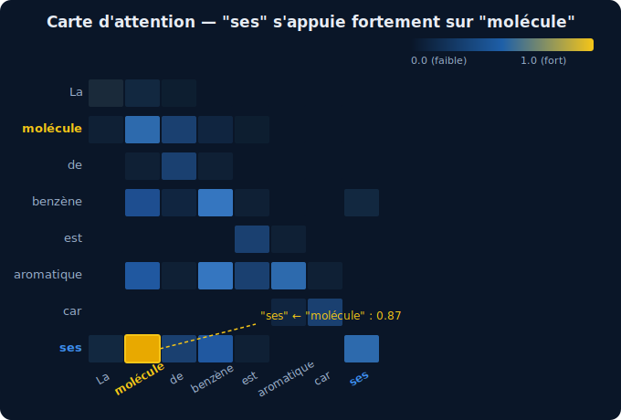
[.caption]
Carte d'attention : chaque cellule montre le poids d'attention entre deux tokens
--

[NOTE.speaker]
--
La division par √d_k évite que les produits scalaires ne deviennent trop grands avec des vecteurs de grande dimension, ce qui ferait disparaître les gradients (saturation du softmax).
--

== L'attention multi-têtes : regarder sous différents angles

[.columns]
--
[.column]
=== Multi-Head Attention

Au lieu d'une seule attention, le Transformer utilise H "têtes" en parallèle.

Chaque tête apprend à regarder différents aspects :
- *Tête 1* : relations syntaxiques (sujet-verbe)
- *Tête 2* : co-références (elle/la molécule)
- *Tête 3* : relations chimiques (réactif/produit)
- *Tête N* : ...

Les résultats sont *concaténés* puis projetés.

[.key-insight]
GPT-4 a ~96 têtes d'attention par couche et 96 couches. Soit ~9 216 "regards" différents simultanés.

[.column]
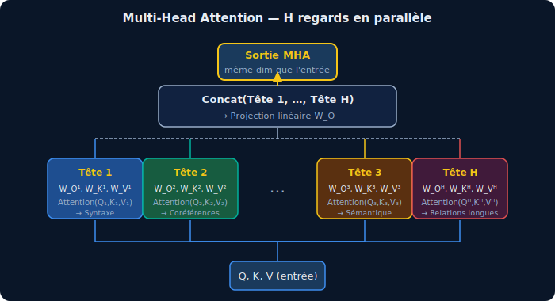
[.caption]
Multi-Head Attention : H projections parallèles, puis concaténation
--

== Architecture complète du Transformer

[.columns]
--
[.column]
=== Blocs répétés N fois

[.architecture-box]
----
Input tokens
    ↓
[Embedding + Positional Encoding]
    ↓ (× N)
┌─────────────────────────┐
│ Multi-Head Attention    │
│ + Residual + LayerNorm  │
│                         │
│ Feed-Forward Network    │
│ + Residual + LayerNorm  │
└─────────────────────────┘
    ↓
Output logits (prob sur vocabulaire)
----

*Positional Encoding* : comme l'attention ne voit pas l'ordre, on injecte la position dans l'embedding

*Feed-Forward* : 2 couches linéaires — le "stockage de connaissances"

[.column]
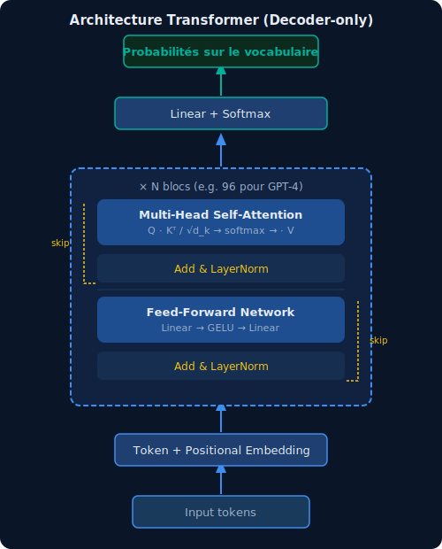
[.caption]
Architecture originale Encoder-Decoder (Vaswani 2017). Les LLMs modernes n'utilisent que le Decoder.
--

== Génération de texte : chercher le meilleur token

[.columns]
--
[.column]
=== Du token au texte : le décodage

[.ft-quote]
____
"At its simplest, the model's aim is now to predict the next word in a sequence and do this repeatedly until the output is complete."

-- Financial Times, _Generative AI exists because of the transformer_ (2023)
____

*Greedy search* : à chaque étape, choisir le token le plus probable.

[.warning-box]
Problème : "sometimes, while each individual token might be the next best fit, the full phrase can be less relevant."

*Beam search* : explorer les N meilleures séquences en parallèle ("faisceaux").
→ Résultat global de meilleure qualité.

*Température* : paramètre qui contrôle la "créativité" :
- T → 0 : déterministe (toujours le token le plus probable)
- T = 1 : distribution naturelle
- T > 1 : plus créatif, plus risqué

[.column]
=== Illustration : beam search (N=3)

[.beam-search]
----
Entrée : "La réaction de Diels-Alder..."
                            ↓
      ┌─────────────────────┴──────────────────┐
   "produit"(0.42)    "donne"(0.31)    "forme"(0.18)
      ↓                    ↓                   ↓
  "un" "des"           "un" "des"          "un" "des"
  ...                  ...                 ...
      └──────────────── Vote final ───────────┘
              "donne un produit bicyclique"
----

*Top-k sampling* : sélectionner aléatoirement parmi les k tokens les plus probables → variété sans incohérence.

*Top-p (nucleus) sampling* : sélectionner parmi les tokens qui couvrent p% de la probabilité cumulée.
--

[NOTE.speaker]
--
La température est l'un des paramètres les plus importants pour contrôler le comportement d'un LLM en production. En chimie, on voudra généralement T faible pour les sorties structurées (SMILES, réactions) et T plus haute pour la génération d'hypothèses créatives.
--

[.columns]
--
[.column]
=== Les 3 phases d'entraînement

*Phase 1 : Pre-training (auto-supervisé)*
- Corpus : internet, livres, code, articles scientifiques
- Tâche : prédire le prochain token
- Coût : ~100M$ pour GPT-4, des mois sur des milliers de GPU

*Phase 2 : Instruction Fine-tuning (SFT)*
- Données : paires (instruction, réponse de qualité)
- Apprend à "suivre des instructions"

*Phase 3 : RLHF*
- Reinforcement Learning from Human Feedback
- Des humains notent les réponses
- Le modèle optimise pour les préférences humaines

[.column]
=== Les scaling laws

[.key-insight]
Performance ≈ f(N_params × N_tokens × compute)

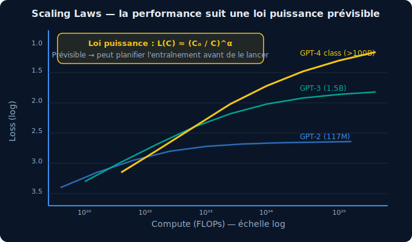
[.caption]
La performance améliore de façon prévisible (loi puissance) avec le compute — ce qui permet de planifier l'entraînement
--

[NOTE.speaker]
--
Le pre-training est de loin la phase la plus coûteuse. Le fine-tuning (SFT + RLHF) ne coûte qu'une fraction. C'est pourquoi on peut adapter un LLM à un domaine spécifique (chimie !) avec des ressources raisonnables.
--

== Limites et hallucinations

[.columns]
--
[.column]
=== Pourquoi les LLMs "inventent" ?

Un LLM *n'est pas un moteur de recherche*. C'est un moteur de prédiction de patterns.

[.ft-quote]
____
"LLMs are not search engines looking up facts; they are pattern-spotting engines that guess the next best option in a sequence. Because of this inherent predictive nature, LLMs can also fabricate information in a process that researchers call 'hallucination'. They can generate made-up numbers, names, dates, quotes — even web links or entire articles."

-- Financial Times, _Generative AI exists because of the transformer_ (2023)
____

*Grounding et RLHF pour limiter le problème* :
- Cross-checking contre des sources vérifiées (RAG)
- Feedback humain (RLHF) — humains qui notent les réponses
- Reste un *grand défi de recherche*

*Pour la chimie* : *TOUJOURS* vérifier les structures, réactions, données physico-chimiques générées par un LLM !

[.column]
=== Mais aussi des capacités émergentes

[.emergent-list]
- Raisonnement en chaîne (Chain-of-Thought)
- Analogies inter-domaines
- Génération de code
- Traduction sans supervision explicite
- ... apparaissent spontanément à grande échelle

Ces capacités n'ont *pas* été programmées — elles émergent de la prédiction du prochain token à très grande échelle.
--

== Au-delà du texte : les Transformers partout

[.columns]
--
[.column]
=== Une architecture universelle de reconnaissance de patterns

[.ft-quote]
____
"Its real power lies beyond language. Its inventors discovered that transformer models could recognise and predict any repeating motifs or patterns. From pixels in an image... to computer code... It could even predict notes in music and DNA in proteins."

-- Financial Times, _Generative AI exists because of the transformer_ (2023)
____

[.domain-grid]
|===
| Domaine | Modèle | Input | Output

| Images | DALL-E, Midjourney | Texte | Image
| Code | GitHub Copilot | Code incomplet | Complétion
| Musique | MusicLM, Suno | Texte | Audio
| *Protéines* | *AlphaFold* | *Séquence AA* | *Structure 3D*
| *Molécules* | *ChemBERTa* | *SMILES* | *Propriétés*
| Science | Galactica | Question | Réponse scientifique
|===

[.column]
=== Pourquoi ça marche partout ?

*La clé* : tout signal structuré peut être "tokenisé" et modélisé comme une séquence.

[.key-insight]
Une molécule SMILES, une séquence d'ADN, un spectre de masse, une image découpée en patches — tous sont des *séquences de tokens* sur lesquelles l'attention opère.

*Ce qui change* : le vocabulaire (atomes vs pixels vs notes) et les données d'entraînement.

*Ce qui ne change pas* : le mécanisme d'attention, les blocs Transformer, les scaling laws.

→ *Un seul paradigme pour comprendre l'IA chimique moderne.*
--

[NOTE.speaker]
--
C'est pourquoi AlphaFold2 est essentiellement un Transformer : l'Evoformer est un Transformer qui traite des séquences d'acides aminés. De même, les modèles de génération moléculaire basés sur SMILES utilisent exactement les mêmes architectures que GPT, juste avec un vocabulaire chimique.
--

// ===========================================================
// PARTIE 3 : IA EN CHIMIE
// ===========================================================

[.part-slide]
== Partie 3 +
L'IA Révolutionne la Chimie

[.part-subtitle]
AlphaFold, drug discovery, synthèse et au-delà

== AlphaFold : résoudre un problème vieux de 50 ans

[.columns]
--
[.column]
=== Le problème du repliement des protéines

*La séquence d'acides aminés* détermine la structure 3D de la protéine.
Mais prédire cette structure depuis la séquence = *problème NP-difficile* (espace de conformations astronomique).

*Levinthal's paradox (1969)* :
Si une protéine de 100 aa testait aléatoirement chaque conformation à 10^13 /s → 10^87 ans pour se replier.
Elle le fait en *microsecondes*. Pourquoi ? L'évolution a trouvé un chemin guidé.

*50 ans de cristallographie aux rayons X et cryo-EM* → ~180 000 structures dans la PDB

*AlphaFold2 (2021)* → prédit avec précision atomique pour ~200 millions de protéines

[.column]
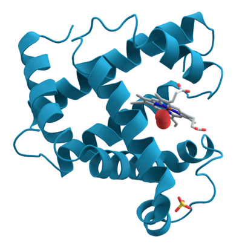
[.caption]
Structure 3D d'une protéine (myoglobine). AlphaFold2 prédit des structures avec une précision comparable à la cristallographie (RMSD < 1 Å) — colorée par confiance pLDDT. +
_(© Wikimedia Commons)_
--

[NOTE.speaker]
--
AlphaFold2 a remporté CASP14 en 2020 avec un score GDT de 92,4/100 — dépassant toutes les méthodes expérimentales et computationnelles. La communauté a été sous le choc.
--

== AlphaFold : comment ça marche

[.columns]
--
[.column]
=== Architecture hybride

*Entrée* : séquence d'acides aminés + alignements multiples (MSA)

*Evoformer* (cœur d'AlphaFold2) :
- Transformer modifié qui traite simultanément :
  - La séquence (1D)
  - La matrice de distances entre résidus (2D)
- Itérations de "communication" entre les deux représentations

*Structure module* :
- Converge vers des coordonnées 3D
- Utilise une représentation en "cadres rigides" (SE(3))

*Résultat* : coordonnées atomiques + score de confiance (pLDDT)

[.column]
=== Impact réel

[.impact-list]
- *Malaria* : nouvelles cibles thérapeutiques identifiées
- *Enzymes industrielles* : optimisation enzymatique
- *Drug discovery* : 40-50% de réduction du temps
- *AlphaFold3* (2024) : étend aux petites molécules, ADN, ARN, ions
- *Base de données* : 214 millions de structures disponibles gratuitement

[.key-insight]
Nobel de Chimie 2024 → David Baker, Demis Hassabis, John Jumper
--

== Drug Discovery accéléré par l'IA

[.columns]
--
[.column]
=== Le pipeline classique

[.pipeline]
----
Identification cible  →  Hit identification  →
Lead optimization  →  Préclinique  →  Clinique

           ~12-15 ans          ~2 milliards $
----

=== Où l'IA intervient

*Identification de cibles* : analyse de données génomiques/protéomiques

*Virtual screening* : docking moléculaire accéléré par DL
→ Schrodinger, Vina-GPU : 10^6 molécules/heure vs 10^3 classique

*Génération de molécules de novo* : modèles génératifs (VAE, Diffusion)
→ "Inventer" des molécules avec les propriétés souhaitées

[.column]
=== Cas concret : Insilico Medicine

[.case-study]
- *2019* : Cible (fibrosis) identifiée par IA
- *2020* : Molécule candidate générée par IA en 21 jours
- *2023* : Essai clinique Phase II positif

Vs pipeline classique : 4-5 ans pour la même étape

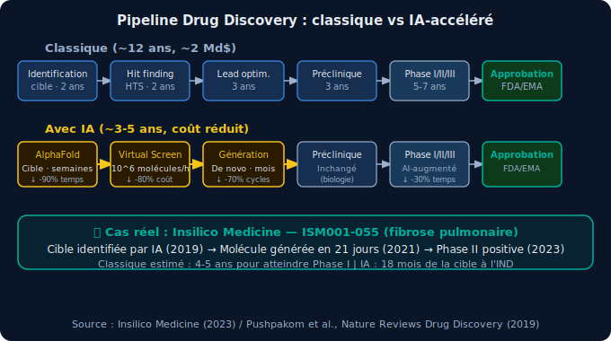
--

[NOTE.speaker]
--
Un autre exemple marquant : Exscientia a découvert DSP-1181 (trouble obsessionnel-compulsif) en 12 mois vs 4.5 ans en moyenne. Le médicament est un antagoniste des récepteurs 5-HT1A/D2.
--

== Génération de molécules : l'IA comme chimiste créateur

[.columns]
--
[.column]
=== Représentations moléculaires

*SMILES* : séquence de caractères linéaire
[source]
----
Aspirine : CC(=O)Oc1ccccc1C(=O)O
Benzène  : c1ccccc1
----

*Graph Neural Networks (GNN)* : la molécule comme graphe
- Atomes = nœuds, liaisons = arêtes
- Message passing entre voisins

*3D (point cloud)* : coordonnées atomiques

=== Modèles génératifs moléculaires

[.model-list]
- *VAE* (Variational AutoEncoder) : espace latent continu → interpolation et optimisation
- *GAN* : génération adversariale de molécules
- *Flow models* : distribution exacte
- *Diffusion* (2023+) : DiffSBDD, DiffDock — génération 3D dans le site actif

[.column]
=== Propriétés ciblables

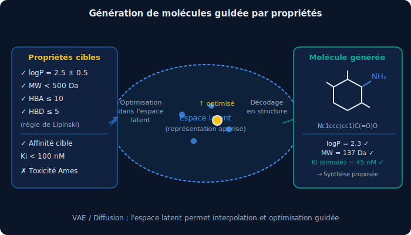
[.caption]
Optimisation guidée : l'espace latent permet de naviguer vers des molécules avec les propriétés souhaitées (solubilité, toxicité, affinité de liaison)
--

== IA pour la spectroscopie et l'analyse chimique

[.columns]
--
[.column]
=== Spectroscopie assistée par IA

*NMR (RMN)* :
- Prédiction automatique des déplacements chimiques
- ACD/Labs, NMRshiftDB
- Identification de molécules inconnues depuis le spectre

*IR / Raman* :
- Identification de mélanges complexes
- Détection de falsification alimentaire
- Contrôle qualité pharmaceutique

*MS (Spectrométrie de masse)* :
- SIRIUS + CSI:FingerID : identification de métabolites
- Performances comparables aux experts humains en 2023

[.column]
=== Contrôle de qualité en temps réel

[.example-box]
*Exemple : Procter & Gamble*
Détection de défauts de produits cosmétiques par vision par ordinateur + spectroscopie NIR
→ 0.01% de faux positifs vs 2% pour le contrôle humain

[.example-box]
*Exemple : détection d'alcool frelaté*
Raman portable + modèle ML
→ Détection du méthanol dans l'alcool de contrebande en terrain
--

== IA pour la synthèse organique

[.columns]
--
[.column]
=== Planification rétrosynthétique

La rétrosynthèse = décomposer une molécule cible en précurseurs disponibles.

*Problème* : espace de recherche combinatoire explosif.

*AiZynthFinder (AstraZeneca)* : Monte Carlo Tree Search + réseaux de neurones
→ Trouve des routes synthétiques en secondes

*IBM RXN* : Transformer entraîné sur 2.5M de réactions
→ Prédit les produits de réaction avec >80% d'exactitude

[.column]
=== Chimie computationnelle + ML

*Potentiels interatomiques ML (MLFF)* :
- DFT (Density Functional Theory) = précision quantique mais coûteux (O(N³))
- MLFF (DeepMD, SchNet, NequIP) : précision DFT, vitesse force field classique
- Applications : simulation de matériaux, dynamique de protéines

[.key-insight]
MACE-MP-0 (2023) : modèle universel entraîné sur ~150 000 matériaux → transfert zero-shot à des systèmes non vus

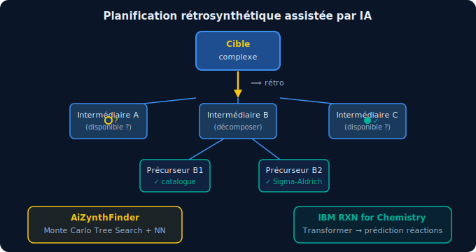
--

[NOTE.speaker]
--
DeepMind a aussi publié GNoME (2023) qui a prédit 2.2 millions de nouveaux cristaux stables — dont 380 000 ont été vérifiés expérimentalement. Une accélération sans précédent de la découverte de matériaux.
--

== IA pour les matériaux et l'énergie

[.columns]
--
[.column]
=== Découverte de nouveaux matériaux

*GNoME (Google DeepMind, 2023)* :
- Graph Neural Network pour prédire la stabilité des cristaux
- 2.2 millions de nouveaux matériaux stables proposés
- 736 validés expérimentalement par robots de synthèse

*Applications énergétiques* :
- Électrolytes pour batteries Li-ion (meilleure conductivité, moindre toxicité)
- Photocatalyseurs pour la production d'H₂
- Membranes pour capture du CO₂

[.column]
=== Self-Driving Labs

[.key-insight]
La combinaison IA + robotique + chimie automatisée = laboratoire autonome

[.example-box]
*Ada (University of British Columbia)* :
Robot qui conçoit, réalise et interprète des expériences de façon autonome.
→ Optimisation de photocatalyseurs 8× plus vite qu'un humain.

[.example-box]
*Chemist AI (2023)* :
LLM qui pilote des robots de synthèse.
→ "Faire synthétiser de l'ibuprofène" → séquence d'actions robotiques complète.
--

// ===========================================================
// PARTIE 4 : LE FUTUR
// ===========================================================

[.part-slide]
== Partie 4 +
Le Futur de l'IA

[.part-subtitle]
Raisonnement, agents, et la question de l'AGI

== Améliorer le raisonnement : au-delà de la prédiction de token

[.columns]
--
[.column]
=== Chain-of-Thought : penser étape par étape

*Problème* : les LLMs ont du mal avec le raisonnement multi-étapes

*Solution* : laisser le modèle "penser à voix haute"

[.example-box]
*Sans CoT* :
Q: 17 × 23 = ?
R: 371 ✗

*Avec CoT* :
Q: 17 × 23 = ? Réfléchissons étape par étape.
R: 17 × 20 = 340. 17 × 3 = 51. 340 + 51 = 391 ✓

*OpenAI o1 / o3 (2024)* : entraîné spécifiquement à raisonner
→ Performances proches des experts en maths olympiques et coding

[.column]
=== Reasoning as Test-Time Compute

[.key-insight]
Idée centrale : au lieu de dépenser tout le compute à l'entraînement, allouer plus de compute à l'inférence (réfléchir plus longtemps)

*Self-Consistency* : générer N raisonnements, voter pour la réponse majoritaire

*Tree of Thoughts* : explorer un arbre de raisonnements possibles

*Process Reward Model* : évaluer la qualité de chaque étape intermédiaire, pas seulement la réponse finale

→ La "pensée lente" de Kahneman appliquée aux LLMs
--

== Les Agents IA : de l'assistant à l'acteur autonome

[.columns]
--
[.column]
=== Qu'est-ce qu'un agent IA ?

Un agent = LLM + outils + mémoire + boucle de décision

[.architecture-box]
----
Observation (environment)
    ↓
[LLM] → Plan → Action → Tool call
    ↑                        ↓
    └──────── Résultat ───────┘
----

*Outils typiques* :
- Recherche web / bases de données scientifiques
- Exécution de code Python (calculs, DFT...)
- Accès à des instruments de labo
- Appels à d'autres agents spécialisés

[.column]
=== Applications en chimie

[.agent-example]
*ChemCrow (2023)* : agent LLM avec 18 outils chimiques
→ Synthèse autonome de chloroquine (antipaludéen)
→ Planification de 4 synthèses complexes

[.agent-example]
*Autonomous Chemical Research (2023, Nature)* :
Agent qui accède à PubChem, exécute du code, commande des réactions robotisées

[.key-insight]
La combinaison Agent IA + Self-Driving Lab = chercheur autonome ?
(Question éthique : quid de la supervision humaine ?)
--

[NOTE.speaker]
--
ChemCrow a planifié la synthèse de DEET (répulsif moustiques) et d'aspirine de façon autonome. Les agents multi-modaux peuvent aussi "lire" des spectres et des images de molécules.
--

== L'AGI : mythe ou horizon proche ?

[.columns]
--
[.column]
=== Définitions en débat

*AGI* = Artificial General Intelligence
→ Un système capable d'accomplir toute tâche cognitive que peut accomplir un humain, dans n'importe quel domaine, sans entraînement spécifique.

*Attention* : ce n'est pas le même concept pour tous !

[.quote]
"AGI est la capacité d'un système à apprendre n'importe quelle tâche aussi bien qu'un humain."
-- OpenAI

[.quote]
"AGI, c'est quand une IA peut générer suffisamment de valeur économique pour payer sa propre R&D."
-- Sam Altman (pragmatique ?)

[.column]
=== Ce qui manque encore (probablement)

[.gaps-list]
- *Compréhension causale* : "corrélation ≠ causalité" — les LLMs confondent encore facilement
- *Embodiment* : comprendre le monde physique via l'expérience directe
- *Efficacité des données* : un enfant apprend en 1000× moins d'exemples
- *Robustesse* : distribution shift, adversarial examples
- *Long-term planning* : cohérence sur des tâches multi-jours

[.timeline-box]
*Prédictions d'experts* : 2030 à "jamais" selon les experts...

→ La vraie question n'est peut-être pas "quand" mais "comment nous y préparer"
--

== Défis et limites actuelles

[.columns.challenges]
--
[.column]
=== Limites techniques

*Hallucinations* : génèrent des informations fausses avec confiance → risque critique en science

*Contexte limité* : même avec 1M tokens (Gemini), les modèles "oublient" en dehors du contexte

*Coût énergétique* : GPT-4 query ~0.001-0.01 kWh → ~10× une recherche Google. À l'échelle mondiale...

*Biais* : héritent des biais des données d'entraînement — corpus scientifique anglophone dominant

[.column]
=== Défis éthiques et réglementaires

*Droits d'auteur* : les modèles entraînés sur des articles scientifiques — légal ?

*Reproductibilité* : les modèles propriétaires ne sont pas auditables

*Impact emploi* : automation de tâches cognitives qualifiées

*IA Act (EU 2024)* : premier cadre réglementaire mondial pour l'IA à haut risque

[.key-insight]
Pour la chimie : les CBRN (chimique, biologique, radiologique, nucléaire) sont un risque identifié des LLMs mal encadrés. Des garde-fous sont en place mais imparfaits.
--

// ===========================================================
// CONCLUSION
// ===========================================================

[.part-slide]
== Conclusion

== Ce qu'il faut retenir

[.takeaways]
--
[.takeaway]
*L'IA n'est pas magique* +
C'est de la statistique sur des données massives + de l'optimisation. Comprendre les principes permet d'utiliser l'IA intelligemment et d'identifier ses limites.

[.takeaway]
*La chimie est un terrain privilégié* +
Données structurées, règles physiques, problèmes combinatoires → l'IA y excelle. AlphaFold, drug discovery, matériaux : la révolution est en cours.

[.takeaway]
*Les outils sont accessibles* +
Hugging Face, RDKit, DeepChem, AlphaFold DB, IBM RXN... Des ressources open-source de qualité existent. Apprenez à les utiliser !

[.takeaway]
*L'humain reste indispensable* +
Interprétation des résultats, validation expérimentale, créativité scientifique, éthique — l'IA augmente mais ne remplace pas (encore) le chimiste.

[.takeaway]
*Agissez maintenant* +
L'IA évolue à vitesse exponentielle. Ceux qui comprennent ces outils aujourd'hui seront mieux positionnés demain.
--

== Ressources pour aller plus loin

[.resources-slide]
--
[.resource-category]
=== 📚 Pour comprendre

* *3Blue1Brown* — "Neural Networks" (YouTube) — visualisations exceptionnelles
* *Andrej Karpathy* — "Let's build GPT from scratch" (YouTube)
* *Fast.ai* — cours pratiques deep learning, gratuits en ligne
* *The Illustrated Transformer* — Jay Alammar (blog)

[.resource-category]
=== 🧪 Pour la chimie

* *DeepChem* — bibliothèque ML pour la chimie (Python, open-source)
* *AlphaFold DB* — alphafold.ebi.ac.uk — 214M structures gratuites
* *IBM RXN* — rxn.app.accelerate.science — prédiction de réactions
* *HuggingFace* — modèles fine-tunés chimie (ChemBERTa, MolT5...)

[.resource-category]
=== 📰 Pour suivre l'actualité

* *Papers With Code* — suivi des SOTA en ML
* *Nature Machine Intelligence* — IA appliquée aux sciences
* *The Batch* (Andrew Ng) — newsletter hebdomadaire
--

[.final-slide]
== Questions ?

[.contact-info]
Chimie ParisTech PSL +
11 rue Pierre et Marie Curie +
75005 Paris

[.social]
icon:github[] github.com/antoinesd/Prez-Intro-IA

[.thank-you]
Merci pour votre attention !
